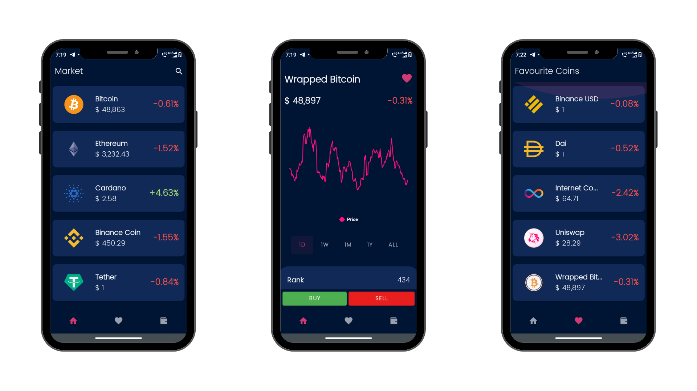

# CryptoZee

### For Downloading the App Check [Release Page](https://github.com/Sanket-Mathur/CryptoZee/releases/) 

# Problem Statement

Crypto is the digital currency of the digital world, it's popularity is increasing incredibly over time, due to the undeniable benefits and perks it comes with. CryptoCurrency is a nonmonetary asset which means it's subject to time in response to economic weather.
It's most popularly known as an investment vehicle. And with investment comes its risks, to dissolve this generic issue and spread the crypto intel to common people, a community app has been designed- CryptoZee. For the insights and proper knowledge of the fragility of crypto, and its benefits. The app also connects the latest updates and stats about the asset. It is for the digital advancement of the era and safe riding into the investment world. The app also states the real-time updates on crypto, so as to improve the trade game of the investors.

# Proposed Solution with Screenshots

Understanding the uncertainty of cryptocurrency the problem arises while starting with trading, predicting the pattern is never easy while getting your hands dirty with crypto, so to aid this, CryptoZee has a suitable algorithm that analyses the history and makes it a lot easier to trade.

# Functionality

It is an android app using the coingecko API for getting the crypto data by the use of a library called retrofit and used a chart library for showing the chart of the price when you click on a coin then an API request made to API then the app shows the data from the data received from the API. 

We can also trade the coin in that room library is used. By default, we get 10000$ in our demo account by which we can trade the crypto coin all the concept of buying and selling of coin is implemented via CRUD operation in the local database.

# Concept Used 

1. Navigation library - For better navigation experience 
2. Live data - for getting the live data of the wallet and from the API request
3. ViewModel - For handling the lifecycle of intents and sharing data between fragments and maintaining clean code
4. Room Database - For the implementation of caching and the demo wallet feature 
5. Material Designs - To get our UI experience better
6. Coroutines - for handling the room database and the API calls in the background  
7. Retrofit   - for API calls and getting our data more accurate
8. AAChartModel  - for showing the chart of the different coins 
9. Glide - for loading and caching the images 
10. Lottie - for adding the animations in our app 
11. MVVM - ease of management of code and for better scalability of the app

# Applications and Future Scope 

One only needs the internet to trade with crypto. The stats speak for themselves that may crypto be risky to flow with but is actually a very beneficial and profitable return to one's dive. It's an era ahead with this leading financial asset. And it'll only grow stronger, as per the experts speak, the crypto market will be more than triple by 2030. So it's never too late to make use of CryptoZee and invest our assets with wit.

# Usage 
1. Get your Favourite Coin Rank, Price  History, Changes of a particular time interval , total market cap and many more.
2. Use Demo wallet to learn how crypto trading works without any fear of losing a single penny.
3. Bookmark your Favourite Coin 

## Tech Used
**Api** - [Coingecko](https://www.coingecko.com/en/api)  
**Library** -   [AAChartModel](https://github.com/AAChartModel/AAChartKit) ,
[Glide](https://github.com/bumptech/glide) , 
[Retrofit](https://github.com/square/retrofit) ,
[Lottie](https://github.com/airbnb/lottie) 
**Language** - Kotlin , XML

>No Special Permission is Required 

### Thanks for Support
 [Samarth Sinha](https://github.com/sinhaSamarth)  

 
